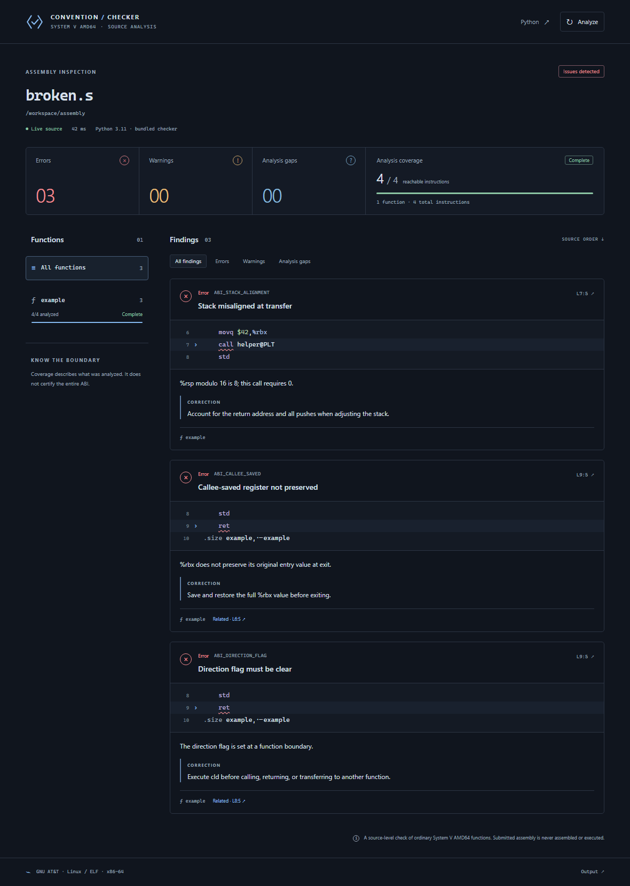

# Assembly Convention Checker

Understand the calling convention behind every instruction. Live diagnostics
identify definite violations, possible violations, and analysis gaps. The report
beside your source connects each finding to its explanation, correction guidance,
related operations, and function coverage.

## Getting started

1. Install the VSIX through **Extensions: Install from VSIX…**.
2. Make Python 3.11+ available on the extension host. No pip install is required.
3. Open GNU AT&T assembly in a `.s` or already-expanded `.S` file.
4. Run **Assembly Convention Checker: Open Report**, or use the editor-title action.

The report follows your active assembly file and retains it while you inspect the
report. Select a finding or related operation to reveal its source. Select a
function or severity to filter the report. Theme colors, keyboard focus, and
reduced-motion preferences are respected.

## Commands

| Command | Behavior |
| --- | --- |
| Analyze Current File | Check the current buffer, including unsaved or untitled text. |
| Open Report | Open or reveal a single report tab beside the source. |
| Select Python Interpreter | Set an executable path on the extension host, or clear it for automatic discovery. |
| Show Output | Inspect runtime and analysis messages. |

Commands are prefixed **Assembly Convention Checker** in the Command Palette.
Automatic detection uses the file extension, so existing syntax-highlighting
extensions remain compatible. Untitled documents with an assembly language ID are
also checked automatically; other text can be checked explicitly.

## Settings

| Setting | Default | Purpose |
| --- | --- | --- |
| `assemblyConventionChecker.enabled` | `true` | Enable analysis. Disabling clears findings. |
| `assemblyConventionChecker.pythonPath` | `""` | Python executable path; empty enables discovery. Shell command strings are not supported. |
| `assemblyConventionChecker.runOn` | `"change"` | `change`: opening, saving, and a 400 ms editing pause; `save`: opening and saving; `manual`: explicit checks only. |
| `assemblyConventionChecker.entries` | `[]` | Entry labels to analyze; empty selects all discovered functions. |

Python discovery tries `py -3`, `python`, then `python3` on Windows, and `python3`
then `python` elsewhere. Only Python 3.11+ is accepted. Analysis is bounded to
10 seconds and 8 MB of process output. Superseded results are discarded.

For WSL/SSH, select an interpreter in that environment. Analysis requires a trusted
workspace. The extension supports desktop and remote extension hosts, not browser-only
or virtual workspaces.

## Reading the report

**Errors** identify known violations; **warnings** identify possible violations;
**analysis gaps** identify constructs or unknown facts that prevent completing a
check. They appear in Problems as Error, Warning, and Information respectively.

Coverage displays analyzed versus reachable instructions. Completeness describes
analysis coverage, independently of whether the function has violations. Inferred
boundaries and incomplete-function reasons stay visible. Green results mean
**“No issues found in the supported checks.”**

The checker targets ordinary System V AMD64 GNU AT&T assembly. It does not certify
the entire ABI, preprocess assembly, execute submitted code, or apply automatic fixes.
Local `.include` files are expanded relative to the containing file. Open, unsaved
include buffers take precedence over disk contents; editing an include refreshes
dependent reports. Included functions, excerpts, Problems, and navigation retain
their original source files. Macros and conditionals still need pre-expansion.

## Build

From the monorepo root: `npm ci`, `npm run build`, then `npm run package`.
The VSIX contains the Python source and all report assets. Publishing to a marketplace
is a separate step; this repository currently produces a local, unpublished package.
